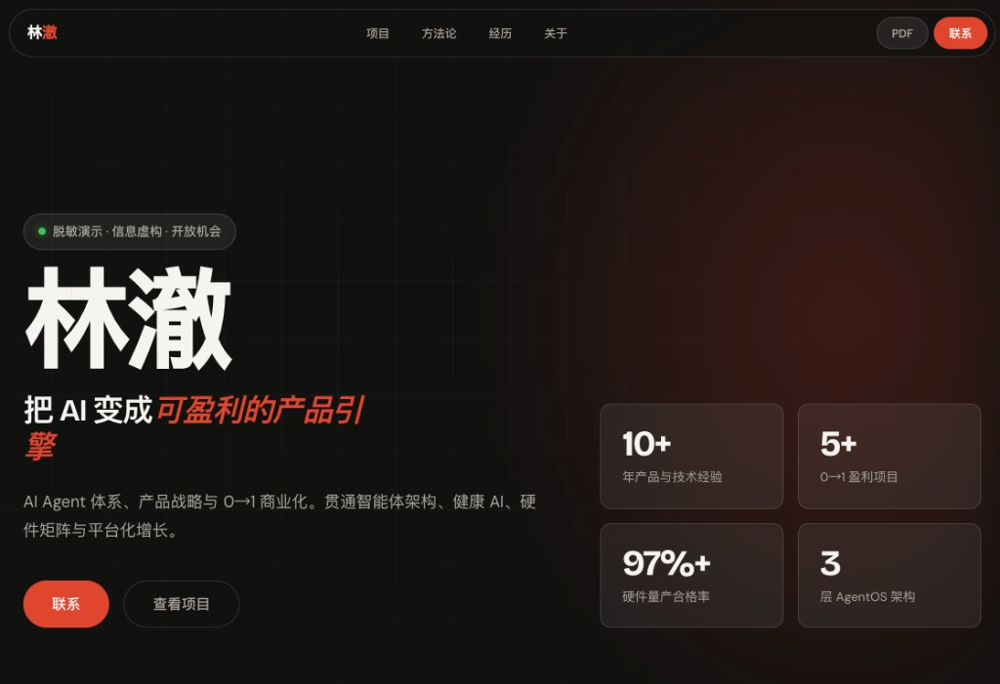
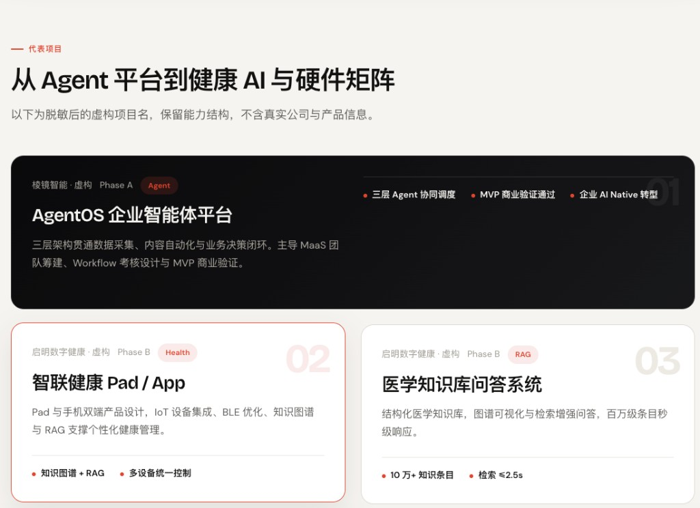

<div align="center">

**English** | [简体中文](./README.zh-CN.md)

# Resume Website Generator Skill

**Turn a PDF resume into a personal website with taste.**

*Anti-Slop Agent Skill — a 9-stage design pipeline that refuses template-looking HTML.*

<br>

[](LICENSE)
[](skill.md)
[](#install)
[](install.sh)
[](https://github.com/Leonxlnx/taste-skill)

<br>

[Install](#install) · [Preview](#preview) · [Pipeline](#nine-stage-pipeline) · [Design Rules](#design-discipline) · [Examples](#example-output) · [Quality Gate](#quality-gate) · [FAQ](#faq) · [License](#license)

</div>

---

## Preview

<p align="center">
  
</p>

<p align="center">
  
</p>

<p align="center"><sub>Desensitized demo output — fictional identity, companies, and dates. Layout: Name-first Hero · floating pill nav · stats bar · Bento projects.</sub></p>

---

## What This Is

Most agents **dump HTML** when they see a resume — Bootstrap cards, purple gradient heroes, skill progress bars. It reads like *generator output*, not *you*.

**Resume Website Generator Skill** does the opposite:

> Design first, code last. Every stage produces a reviewable artifact. Frontend work starts at Stage 8 only.

It encodes the workflow of a **Staff Product Designer + Design System Architect + Senior Frontend Engineer** into a portable Skill for Cursor, Claude Code, Codex, Gemini CLI, and other agents.

```
PDF / DOC / Markdown resume
        ↓
  Extract → Analyze → IA → Strategy → Design System
        ↓
  Wireframes + Layout Spec → UI Spec → Frontend → Quality Review
        ↓
  output/<name>/website/   ← deployable static site
```

**Core constraint:** Stages 1–7 **must not** generate HTML, CSS, or JS. No design artifacts → no code.

---

## Install

### Cursor (recommended)

```bash
# From your project root
bash Resume-Website-Generator-Skill/install.sh

# Or from inside the skill folder
cd Resume-Website-Generator-Skill && bash install.sh
```

Then ask Cursor:

> Use the resume-website-generator skill to build a personal website from my resume.

### Any Agent

1. Add this repo to agent context
2. Load [`skill.md`](skill.md) + [`system-prompt.md`](system-prompt.md)
3. Provide a resume file and execute [`workflow/`](workflow/) stages 01 → 09 in order

### Preview the demo site

```bash
cd examples/example-output-sanbao
npx serve .
```

---

## How It Differs

| | Typical "resume → web" | This Skill |
|---|---|---|
| Deliverables | One HTML file | 9 design artifacts + site + review report |
| Layout | Sidebar / 3-column cards | **Name-first Hero** + floating pill nav |
| Aesthetic | Default AI template | **Design Read** + three dials + Pre-Flight anti-slop |
| Quality | No gate | Stage 09 score ≥ 85 to ship |
| Privacy | Often leaks PII | Supports desensitized demo workflow |

---

## Nine-Stage Pipeline

| Stage | Output | Code? |
|-------|--------|-------|
| 01 Extract | `resume-data.json` | ✗ |
| 02 Analyze | `candidate-analysis.md` | ✗ |
| 03 IA | `information-architecture.md` | ✗ |
| 04 Strategy | `design-strategy.md` + Design Read | ✗ |
| 05 Design System | `design-system.md` | ✗ |
| 06 Wireframe | `wireframes.md` + `layout-spec.md` | ✗ |
| 07 UI Spec | `ui-composition.md` | ✗ |
| 08 Frontend | `website/` | **✓** |
| 09 Review | `review-report.md` | fixes only |

See [`skill.md`](skill.md) and each [`workflow/`](workflow/) file for details.

---

## Design Discipline

### Layout contract

From [`rules/layout-system.md`](rules/layout-system.md):

- **Name-first Hero** — the candidate's name is the largest element on the page
- **Floating pill navigation** — not an edge-to-edge sticky bar
- **Stats bar** — four verifiable proof points in the hero
- **Layout variety** — no single card-grid pattern repeated across every section

### Taste discipline (v1.2)

Adapted from [taste-skill](https://github.com/Leonxlnx/taste-skill) — see [`rules/design-taste.md`](rules/design-taste.md):

| Mechanism | Purpose |
|-----------|---------|
| **Design Read** | Stage 04: one-line read of audience + vibe + aesthetic family |
| **Three dials** | `VARIANCE` / `MOTION` / `DENSITY` govern layout and motion |
| **Pre-Flight** | Stage 09 mechanical checks: eyebrow cap, accent lock, slop scan |

**Rejected by default:** purple mesh heroes · Inter+slate defaults · uppercase label on every section · warm beige+brass palette · skill progress bars · "Download CV" as primary CTA

---

## Project Structure

```
Resume-Website-Generator-Skill/
├── skill.md                 # Skill entry (→ SKILL.md after Cursor install)
├── system-prompt.md         # Agent persona and operating contract
├── install.sh               # One-line install
├── workflow/                # Stages 01–09 prompts
├── rules/                   # Design & engineering constraints
│   ├── layout-system.md     # ★ Layout contract
│   ├── design-taste.md      # ★ Anti-slop taste
│   ├── design-principles.md
│   └── frontend-rules.md
├── templates/               # Artifact templates
└── examples/
    ├── example-input-sanbao.md
    └── example-output-sanbao/   # Public demo (fictional identity)
```

---

## Example Output

Screenshots above are from a **desensitized AI PM resume** run (all PII replaced with fictional data).

| Input | Output | Notes |
|-------|--------|-------|
| [example-input-sanbao.md](examples/example-input-sanbao.md) | [example-output-sanbao/](examples/example-output-sanbao/) | Fictional [SanbaoAI](https://github.com/SanbaoAI) — safe to publish |
| [example-input.md](examples/example-input.md) | [example-output/website/](examples/example-output/website/) | Jane Chen — product designer sample |

Local preview:

```bash
cd examples/example-output-sanbao && npx serve .
```

---

## Output Convention

Each run creates:

```
output/<candidate-slug>/
├── artifacts/          # Full design artifact chain (iterable, reviewable)
└── website/            # Static site (deploy to Netlify / Vercel / GitHub Pages)
```

---

## Quality Gate

Stage 09 scores eight dimensions (0–100). **Weighted average must be ≥ 85** to pass.

Below threshold → agent loops back to the earliest affected stage (max 2 rounds).

See [`workflow/09-Quality-Review.md`](workflow/09-Quality-Review.md) and [`templates/review-template.md`](templates/review-template.md).

---

## FAQ

**How is this different from "just ask AI to build my resume site"?**  
This Skill enforces artifact-first delivery: strategy, system, and wireframes exist before any code. The first version is not a template dump.

**What input formats are supported?**  
PDF, DOCX, DOC, Markdown, plain text.

**Must I use vanilla HTML?**  
Default stack is semantic HTML + CSS custom properties + minimal JS. Stage 08 can target Next.js, Astro, etc. if the user asks.

**How does this relate to [taste-skill](https://github.com/Leonxlnx/taste-skill)?**  
taste-skill governs frontend taste; this Skill governs the full resume → design → code pipeline. v1.2 adapts Design Read, dials, and Pre-Flight for portfolio sites.

**Will real resume data leak?**  
Use fictional data for public examples (`example-input-sanbao`). Do not commit repos containing real phone numbers or emails.

---

## Contributing

PRs welcome: new profession examples, Stage 08 framework variants, workflow refinements.

---

## License

MIT — free for personal and commercial agent workflows.

---

## Credits

- Taste discipline adapted from **[Leonxlnx/taste-skill](https://github.com/Leonxlnx/taste-skill)**
- Optional UI search integration: [UI/UX Pro Max](https://github.com/nextlevelbuilder/ui-ux-pro-max-skill)
- Built for the agent-assisted design-to-code era

<div align="center">

<br>

**A resume is an admin document. A website is a brand narrative.**

<br>

**English** | [简体中文](./README.zh-CN.md)

</div>
