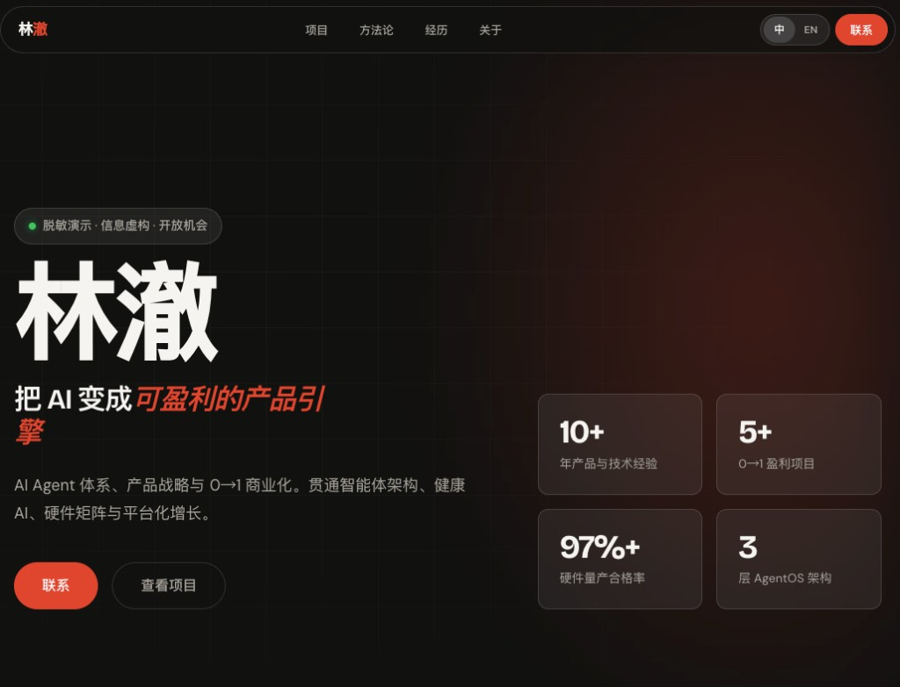
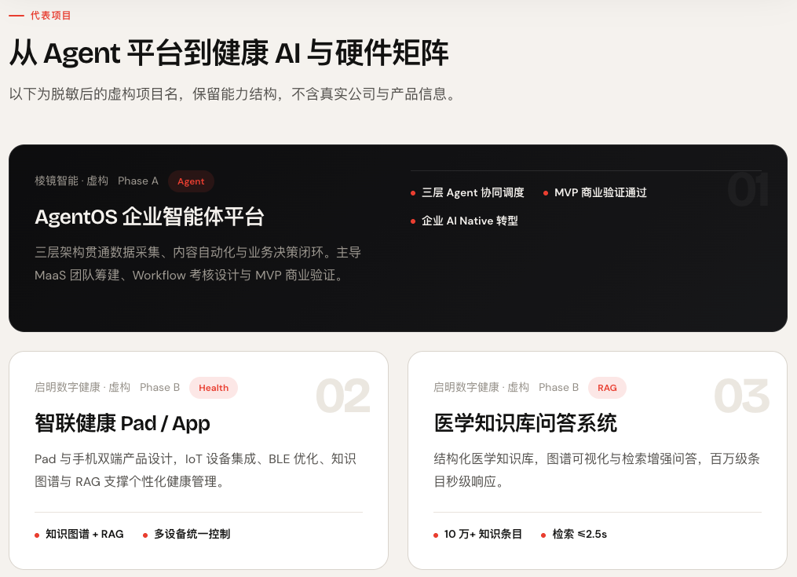

<div align="center">

[**English**](./README.md) | **简体中文**

# Resume Website Generator Skill

**把 PDF 简历，做成有品位的个人网站。**

*Anti-Slop Agent Skill — 九阶段设计流水线，拒绝模板感 HTML。*

<br>

[](LICENSE)
[](skill.md)
[](#安装)
[](install.sh)
[](https://github.com/Leonxlnx/taste-skill)

<br>

[安装](#安装) · [预览](#预览) · [流水线](#九阶段流水线) · [设计纪律](#设计纪律) · [示例](#示例输出) · [质量门禁](#质量门禁) · [FAQ](#常见问题) · [License](#license)

</div>

---

## 预览

<p align="center">
  
</p>

<p align="center">
  
</p>

<p align="center"><sub>脱敏演示输出 — 姓名、公司、时间均为虚构。支持中英文切换 · Name-first Hero · 浮动 Pill 导航 · Stats Bar · Bento 项目区。</sub></p>

---

## 这是什么

大多数 Agent 收到简历后会**直接吐 HTML**——Bootstrap 卡片、紫色渐变 Hero、技能进度条。看起来像「生成器输出」，不像「你本人」。

**Resume Website Generator Skill** 做相反的事：

> 先设计，后写码。每个阶段产出可审查的中间文件，Stage 8 才开始写前端。

它把 **Staff 产品设计师 + 设计系统架构师 + 高级前端** 的工作流写进 Skill，供 Cursor、Claude Code、Codex、Gemini CLI 等 Agent 逐步执行。

```
PDF / DOC / Markdown 简历
        ↓
  提取 → 分析 → 信息架构 → 设计策略 → 设计系统
        ↓
  线框图 + 布局规格 → UI 规格 → 前端实现 → 质量评审
        ↓
  output/<name>/website/   ← 可部署的静态站点
```

**核心约束：** Stage 1–7 **禁止**生成 HTML/CSS/JS。没有设计产物，就不写代码。

---

## 安装

一条脚本同时安装到 **Cursor、Claude Code、Codex、OpenCode**（用户级 Skill 目录，自动 `skill.md` → `SKILL.md`）：

```bash
git clone https://github.com/SanbaoAI/Resume-Website-Generator-Skill.git
cd Resume-Website-Generator-Skill && bash install.sh
```

**安装参数**（默认 = 四个 Agent 全部安装）：

| 参数 | 目标路径 |
|------|----------|
| `--cursor` | `~/.cursor/skills/resume-website-generator/` |
| `--claude` | `~/.claude/skills/resume-website-generator/` |
| `--codex` | `~/.codex/skills/resume-website-generator/` |
| `--opencode` | `~/.config/opencode/skills/resume-website-generator/` |

```bash
bash install.sh --cursor --codex   # 按需选择
bash install.sh --help
```

重启 Agent（或开新会话）后：

> 用 resume-website-generator，把我的简历做成个人网站。

---

### 其他 Agent

**skills.sh**（Gemini CLI、Windsurf、Copilot 等 60+ Agent）：

```bash
npx skills add SanbaoAI/Resume-Website-Generator-Skill -g -y
```

**Gemini CLI：**

```bash
gemini skills install https://github.com/SanbaoAI/Resume-Website-Generator-Skill --consent
```

**手动兜底** — 加载 [`skill.md`](skill.md) + [`system-prompt.md`](system-prompt.md)，按 [`workflow/`](workflow/) 01 → 09 执行。见 [FAQ](#常见问题)。

---

### 预览示例站点

```bash
cd examples/example-output-sanbao
npx serve .
```

---

## 和其他方案有什么不同

| | 普通「简历转网页」 | 本 Skill |
|---|---|---|
| 输出物 | 一个 HTML 文件 | 9 份设计产物 + 网站 + 评审报告 |
| 布局 | 侧边栏 / 三列卡片 | **Name-first Hero** + 浮动 Pill 导航 |
| 审美 | AI 默认模板 | **Design Read** + 三档拨盘 + Pre-Flight 反 Slop |
| 质量 | 无门禁 | Stage 09 打分 ≥85 才交付 |
| 隐私 | 常泄露真实信息 | 支持脱敏示例工作流 |

---

## 九阶段流水线

| 阶段 | 产出 | 写代码？ |
|------|------|----------|
| 01 提取 | `resume-data.json` | ✗ |
| 02 分析 | `candidate-analysis.md` | ✗ |
| 03 信息架构 | `information-architecture.md` | ✗ |
| 04 设计策略 | `design-strategy.md` + Design Read | ✗ |
| 05 设计系统 | `design-system.md` | ✗ |
| 06 线框图 | `wireframes.md` + `layout-spec.md` | ✗ |
| 07 UI 规格 | `ui-composition.md` | ✗ |
| 08 前端 | `website/` | **✓** |
| 09 评审 | `review-report.md` | 修复 only |

详细说明见 [`skill.md`](skill.md) 与各阶段 [`workflow/`](workflow/) 文件。

---

## 设计纪律

### 布局硬约束

见 [`rules/layout-system.md`](rules/layout-system.md)：

- **Name-first Hero** — 姓名是页面最大元素
- **浮动 Pill 导航** — 非贴边 sticky 条
- **Stats Bar** — Hero 内 4 个可验证数据点
- **Section 布局多样性** — 禁止全站同一种卡片网格

### 品味纪律（v1.2）

借鉴 [taste-skill](https://github.com/Leonxlnx/taste-skill) 的 anti-slop 思路，见 [`rules/design-taste.md`](rules/design-taste.md)：

| 机制 | 作用 |
|------|------|
| **Design Read** | Stage 04 先读房间：受众 + 气质 + 美学方向 |
| **三档拨盘** | `VARIANCE` / `MOTION` / `DENSITY` 控制布局与动效 |
| **Pre-Flight** | Stage 09 机械检查：Eyebrow 上限、Accent 锁定、Slop 扫描 |

**默认拒绝：** 紫蓝 mesh Hero · Inter+slate 无脑组合 · 每段 uppercase 标签 · 暖 beige+brass 套路 · 技能进度条 · 「下载 CV」主 CTA

---

## 项目结构

```
Resume-Website-Generator-Skill/
├── skill.md                 # Skill 入口（Cursor 安装后 → SKILL.md）
├── system-prompt.md         # Agent 角色与操作契约
├── install.sh               # 一键安装
├── workflow/                # 01–09 阶段提示词
├── rules/                   # 设计 & 工程约束
│   ├── layout-system.md     # ★ 布局硬约束
│   ├── design-taste.md      # ★ Anti-Slop 品味
│   ├── design-principles.md
│   └── frontend-rules.md
├── templates/               # 产物模板
└── examples/
    ├── example-input-sanbao.md
    └── example-output-sanbao/   # 公开演示（虚构身份）
```

---

## 示例输出

上方截图为 **AI 产品经理简历脱敏生成** 的实际效果（全部个人信息已替换为虚构数据）。

| 输入 | 输出 | 说明 |
|------|------|------|
| [example-input-sanbao.md](examples/example-input-sanbao.md) | [example-output-sanbao/](examples/example-output-sanbao/) | 虚构身份 [SanbaoAI](https://github.com/SanbaoAI)，可公开 |
| [example-input.md](examples/example-input.md) | [example-output/website/](examples/example-output/website/) | Jane Chen 设计师示例 |

本地预览：

```bash
cd examples/example-output-sanbao && npx serve .
```

---

## 输出目录约定

每次运行生成：

```
output/<candidate-slug>/
├── artifacts/          # 设计产物链（可迭代、可审查）
└── website/            # 静态站点（Netlify / Vercel / GitHub Pages 可部署）
```

---

## 质量门禁

Stage 09 从 8 个维度打分（0–100），**加权平均 ≥ 85** 才通过。

未达标 → 自动回溯最早受影响阶段修复（最多 2 轮）。

见 [`workflow/09-Quality-Review.md`](workflow/09-Quality-Review.md) 与 [`templates/review-template.md`](templates/review-template.md)。

---

## 常见问题

**支持哪些 Agent？**  
Cursor、Claude Code、Codex、Gemini CLI、OpenCode、Windsurf、GitHub Copilot、Cline 等；亦可通过 [skills.sh](https://skills.sh) 覆盖 60+ Agent。任意 Agent 也可手动加载 `skill.md` + `workflow/` 运行。见[安装](#安装)。

**这和直接让 AI「帮我做简历网站」有什么区别？**  
本 Skill 强制 artifact-first：先有策略、系统、线框，再写码。避免第一版就是模板。

**支持哪些输入格式？**  
PDF、DOCX、DOC、Markdown、纯文本。

**必须用 vanilla HTML 吗？**  
默认是语义 HTML + CSS 变量 + 少量 JS。用户明确要求时 Stage 08 可换 Next.js / Astro 等。

**和 [taste-skill](https://github.com/Leonxlnx/taste-skill) 什么关系？**  
taste-skill 管「前端品味」；本 Skill 管「简历 → 完整设计流水线」。v1.2 已将 taste-skill 的 Design Read、拨盘、Pre-Flight 适配进简历场景。

**真实简历会泄露吗？**  
公开示例请用虚构数据（见 `example-input-sanbao`）。私人站点请勿提交含真实电话/邮箱的仓库。

---

## 贡献

欢迎 PR：新职业示例、Stage 08 框架变体、工作流 refinement。

---

## License

MIT — 个人与商业 Agent 工作流均可自由使用。

---

## Credits

- 设计品味纪律 adapted from **[Leonxlnx/taste-skill](https://github.com/Leonxlnx/taste-skill)**
- UI 搜索可选集成 [UI/UX Pro Max](https://github.com/nextlevelbuilder/ui-ux-pro-max-skill)
- Built for the agent-assisted design-to-code era

<div align="center">

<br>

**简历是行政文档。网站是品牌叙事。**

<br>

[English](./README.md) | **简体中文**

</div>
